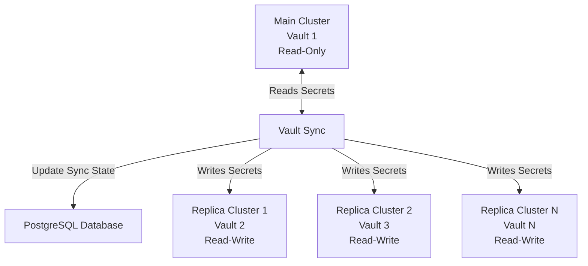
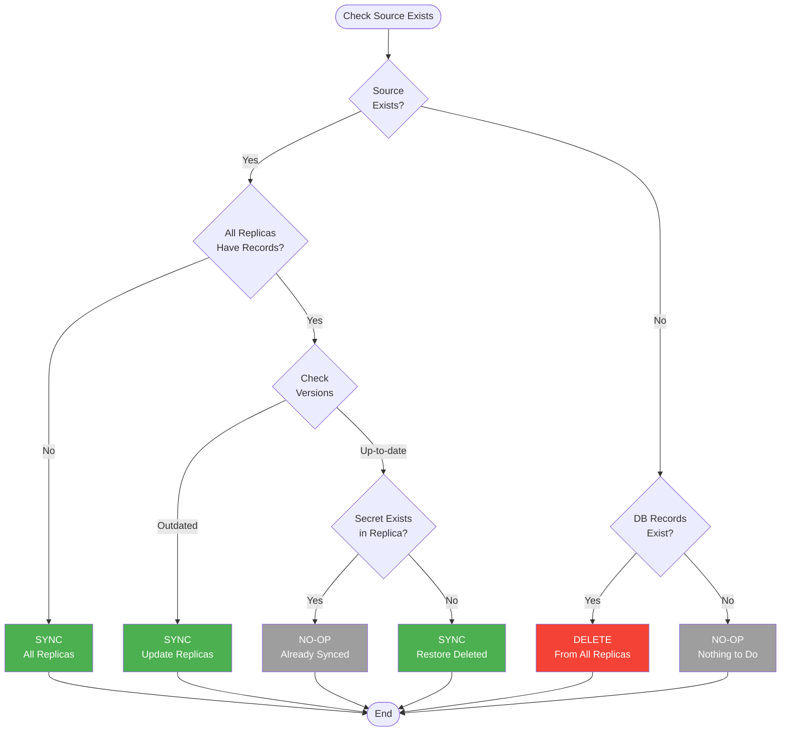

# Vault Sync

A production-ready tool for synchronizing secrets across multiple HashiCorp Vault clusters.

## What It Does

Vault Sync keeps your secrets synchronized between a main Vault cluster and multiple replica clusters. It tracks what's been synced, handles version changes, and makes smart decisions about when to sync, update, or delete secrets.

## Key Features

- **Smart Sync Logic**: Only syncs when needed (version changes, new secrets, deletions)
- **Multi-Cluster Support**: One main cluster (read-only) → multiple replicas (read-write)
- **Path Filtering**: Use patterns to include/exclude specific paths
- **State Tracking**: PostgreSQL database tracks sync status and versions
- **Secure Authentication**: AppRole-based authentication with proper permissions
- **Production Ready**: Comprehensive logging, error handling, and testing

## Architecture



## How It Decides What to Sync



## Quick Start

### Prerequisites

- Go 1.23+
- PostgreSQL 16+
- HashiCorp Vault 1.15+
- Docker (for local development)

### Local Development Setup

```bash
# Clone and setup
git clone https://github.com/binsabbar/vault-sync.git
cd vault-sync

# Start local environment with Docker
make setup

# This will:
# - Start Vault clusters and PostgreSQL
# - Initialize Vault with AppRole auth
# - Generate configuration files
# - Seed test secrets
```

### Build from Source

```bash
# Build binary
make go-build

# Build Docker image
make docker-build

# Run tests
make go-test

# Run linting
make go-lint
```

## Configuration

Create a `config.yaml` file:

```yaml
id: vault-sync-prod
log_level: info
concurrency: 10

sync_rule:
  interval: 60s
  kv_mounts:
    - production
    - uat
    - stage
  paths_to_replicate:
    - "**"                    # Sync all paths
  paths_to_ignore:
    - "temp/**"               # Ignore temp directories
    - "**/.archive/**"        # Ignore archive folders

postgres:
  address: localhost
  port: 5432
  username: vault_role
  password: vault_password
  db_name: vault_db
  ssl_mode: require

vault:
  main_cluster:
    name: main-cluster
    address: https://vault-main.example.com
    app_role_id: ${VAULT_MAIN_ROLE_ID}
    app_role_secret: ${VAULT_MAIN_SECRET}
    app_role_mount: approle

  replica_clusters:
    - name: replica-us-east
      address: https://vault-replica-east.example.com
      app_role_id: ${VAULT_REPLICA_EAST_ROLE_ID}
      app_role_secret: ${VAULT_REPLICA_EAST_SECRET}
      app_role_mount: approle
```

### Path Filtering

Vault Sync uses glob patterns to control which secrets are synchronized. You can use powerful patterns to include or exclude specific paths:

**Basic Examples:**
```yaml
paths_to_replicate:
  - "production/**"     # All production secrets (recursive)
  - "configs/app*"      # App configs only (exact depth)
  - "*/certs/*"         # All certificates (single level)

paths_to_ignore:
  - "temp/**"           # No temporary files anywhere
  - "*/dev"             # No development configs
  - "*test*"            # Nothing with "test" in name
```

**Pattern Types:**
- `secret` → Exact match only
- `secret/*` → All paths under secret/ (any depth)
- `secret/**` → All paths under secret/ (recursive)
- `*app*` → Contains "app" at root level
- `*/config` → Two-level paths ending in "config"

> **⚠️ IMPORTANT NOTES:**
> 
> **📍 Mount Names**: Patterns are **mount-relative** and should NOT include mount names. Mount names are specified separately in the `kv_mounts` section. 
> - ✅ Correct: `production/**`, `configs/app*`
> - ❌ Wrong: `team-a/production/**`, `my-mount/configs/app*`
>
> **⚡ Performance**: Complex patterns with many wildcards (especially `**`) can impact performance on large Vault instances. Consider:
> - Use specific patterns instead of broad ones when possible
> - Prefer exact matches over wildcard patterns for known paths
> - Test patterns on non-production environments first
> - Monitor sync performance and adjust patterns if needed

**📖 For comprehensive pattern matching examples and advanced usage, see the [Path Matching Guide](internal/service/pathmatching/README.md)**

## Usage

### Sync Operations

```bash
# One-time sync (recommended for production)
vault-sync sync once --config config.yaml

# Preview what would be synced (dry run)
vault-sync sync dry-run --config config.yaml

# Future: Daemon mode with scheduler (coming soon)
# vault-sync sync daemon --config config.yaml
```

### Path Testing

```bash
# Test patterns against a list of paths from file
vault-sync path-matcher --paths-file test-paths.txt --config config.yaml

# Create a test file with paths to validate
cat > test-paths.txt << 'EOF'
production/app/database/password
production/temp/cache-keys
uat/api/jwt-secrets
stage/infra/ssl-certificates
EOF
```

### Configuration Management

```bash
# View configuration
vault-sync config-print --config config.yaml

# View specific section as JSON
vault-sync config-print --section vault --format json
```

## Security Setup

### Main Cluster (Read-Only Access)

```hcl
# AppRole policy for main cluster
path "production/*" {
  capabilities = ["read", "list"]
}
path "uat/*" {
  capabilities = ["read", "list"]
}
path "stage/*" {
  capabilities = ["read", "list"]
}
```

### Replica Clusters (Read-Write Access)

```hcl
# AppRole policy for replica clusters
path "production/*" {
  capabilities = ["create", "read", "update", "delete", "list"]
}
path "uat/*" {
  capabilities = ["create", "read", "update", "delete", "list"]
}
path "stage/*" {
  capabilities = ["create", "read", "update", "delete", "list"]
}
```

## Production Deployment

### Linux Cron Job

```bash
# Run one-time sync every 5 minutes
*/5 * * * * /usr/local/bin/vault-sync sync once --config /etc/vault-sync/config.yaml

# Test before deploying (dry run)
# /usr/local/bin/vault-sync sync dry-run --config /etc/vault-sync/config.yaml
```

### Kubernetes CronJob

```yaml
apiVersion: batch/v1
kind: CronJob
metadata:
  name: vault-sync
spec:
  schedule: "*/5 * * * *"
  concurrencyPolicy: Forbid
  jobTemplate:
    spec:
      template:
        spec:
          containers:
          - name: vault-sync
            image: ghcr.io/binsabbar/vault-sync:latest
            command: ["vault-sync", "sync", "once", "--config", "/config/config.yaml"]
            env:
            - name: VAULT_MAIN_ROLE_ID
              valueFrom:
                secretKeyRef:
                  name: vault-sync-credentials
                  key: main-role-id
            volumeMounts:
            - name: config
              mountPath: /config
          volumes:
          - name: config
            configMap:
              name: vault-sync-config
```

## Testing

```bash
# Unit tests
make go-test

# Integration tests (requires Docker)
make go-test

# Test with coverage
make go-test-coverage

# Lint code
make go-lint

# Format code
make go-fmt
```

## Available Commands

### Sync Commands

| Command                   | Description                                   |
| ------------------------- | --------------------------------------------- |
| `vault-sync sync once`    | Run one-time sync operation                   |
| `vault-sync sync dry-run` | Preview what would be synced (no actual sync) |

### Utility Commands

| Command                   | Description                              |
| ------------------------- | ---------------------------------------- |
| `vault-sync path-matcher` | Test path patterns against list of paths |
| `vault-sync config-print` | View configuration                       |

### Development Commands

| Make Target         | Description                      |
| ------------------- | -------------------------------- |
| `make setup`        | Complete local setup with Docker |
| `make go-build`     | Build binary                     |
| `make go-test`      | Run tests                        |
| `make go-lint`      | Run linting                      |
| `make docker-build` | Build Docker image               |

### Documentation

| Resource                                                       | Description                                    |
| -------------------------------------------------------------- | ---------------------------------------------- |
| [Path Matching Guide](internal/service/pathmatching/README.md) | Comprehensive guide for pattern matching rules |

## Roadmap

- **Built-in Scheduler**: Native interval-based scheduling (coming soon)
- **Reconciliation Modes**: Force and smart reconciliation (planned)
- **Health Endpoints**: HTTP health checks (planned)
- **Metrics Export**: Prometheus metrics (planned)

## Contributing

1. Fork the repository
2. Create a feature branch (`git checkout -b feature/amazing-feature`)
3. Write tests for your changes
4. Ensure all tests pass (`make go-test`)
5. Submit a pull request

## License

MIT License - see [LICENSE](LICENSE) file for details.

---

Built with ❤️ using Go
