# Release Process

This document describes the automated release process for vault-sync.

## Overview

We use **GitHub Flow** with automated changelog management via [changie](https://changie.dev/). The process is streamlined with two main workflows that handle everything automatically.

## Quick Start

### For Regular Releases

1. **Add changelog entries** during development:
   ```bash
   changie new
   # Follow the prompts to describe your change
   ```

2. **Prepare the release**:
   ```bash
   gh workflow run prepare-release.yaml -f version=1.0.0 -f prerelease_type=none
   ```

3. **Review and merge** the auto-created PR

4. **Create the release**:
   ```bash
   gh workflow run release.yaml -f version=1.0.0 -f release_type=stable
   ```

That's it! The release is live within minutes. 🎉

---

## Release Types

We follow [Semantic Versioning](https://semver.org/):

| Type       | Format           | Example          | Use Case                         |
| ---------- | ---------------- | ---------------- | -------------------------------- |
| **Stable** | `vX.Y.Z`         | `v1.0.0`         | Production releases              |
| **Alpha**  | `vX.Y.Z-alpha.N` | `v1.0.0-alpha.1` | Early testing, unstable          |
| **Beta**   | `vX.Y.Z-beta.N`  | `v1.0.0-beta.1`  | Feature complete, testing        |
| **RC**     | `vX.Y.Z-rc.N`    | `v1.0.0-rc.1`    | Release candidate, final testing |

**Version suffixes auto-increment:** Running the same command twice automatically bumps the suffix (`.1` → `.2` → `.3`).

---

## Development Workflow

### 1. Add Changelog Entries

For every user-facing change, add a changelog entry:

```bash
changie new
```

**Interactive prompts:**
```
? What kind of change is this?
  > ✨ Added          (new features)
    🐛 Fixed          (bug fixes)
    💥 Breaking Changes
    🔄 Changed        (improvements)
    🔒 Security       (security fixes)
    ⚡ Performance    (performance improvements)
    📚 Documentation  (docs updates)
    ⚠️ Deprecated     (deprecation warnings)
    🗑️ Removed        (removed features)
    ⚠️ Known Issues   (known limitations)

? What's the change? Fix race condition in circuit breaker

✅ Created: .changes/unreleased/20251030_123456_fixed.yaml
```

**Commit the changelog entry with your code:**
```bash
git add .changes/unreleased/
git commit -m "fix: race condition in circuit breaker"
```

### 2. Create Pull Request

```bash
gh pr create --base main --title "Fix race condition"
```

**Automated checks run:**
- ✅ Tests
- ✅ Linting
- ✅ Snapshot build
- ✅ Release freeze check

### 3. Merge to Main

```bash
gh pr merge --squash
```

---

## Release Process

### Step 1: Prepare Release

Run the **prepare-release** workflow to collect all changelog entries:

```bash
# For stable release
gh workflow run prepare-release.yaml -f version=1.0.0 -f prerelease_type=none

# For pre-release
gh workflow run prepare-release.yaml -f version=1.0.0 -f prerelease_type=alpha
```

**What happens automatically:**
1. ✅ Collects all unreleased changelog entries
2. ✅ Auto-calculates next pre-release number (e.g., `alpha.1` → `alpha.2`)
3. ✅ Updates `CHANGELOG.md` with structured changelog
4. ✅ Creates PR with changelog changes to `main`
5. ✅ **Activates release freeze** (blocks other PRs from merging)

### Step 2: Review Changelog PR

The workflow creates a PR with:
- Complete changelog for the version
- Count of changes included
- Next steps for creating the release

**Review the PR:**
```bash
gh pr view
```

**Merge when ready:**
```bash
gh pr merge --squash
```

**Note:** Once merged, the release freeze is lifted automatically.

### Step 3: Create Release

Trigger the **release** workflow:

```bash
# For stable release
gh workflow run release.yaml -f version=1.0.0 -f release_type=stable

# For pre-release
gh workflow run release.yaml -f version=1.0.0 -f release_type=alpha
```

**What happens automatically:**
1. ✅ Auto-calculates next suffix (for pre-releases)
2. ✅ Creates git tag from `main` branch
3. ✅ Builds binaries for all platforms (Linux, macOS, Windows - amd64/arm64)
4. ✅ Builds and pushes multi-arch Docker images to GHCR
5. ✅ Creates GitHub Release with changelog from changie
6. ✅ Generates checksums for all artifacts

**Releases complete in ~5 minutes!**

---

## Release Artifacts

Every release includes:

| Artifact          | Description                | Location                              |
| ----------------- | -------------------------- | ------------------------------------- |
| **Git Tag**       | Version tag                | `v1.0.0`, `v1.0.0-alpha.1`, etc.      |
| **Binaries**      | Cross-platform executables | GitHub Releases                       |
| **Docker Images** | Multi-arch containers      | `ghcr.io/binsabbar/vault-sync:v1.0.0` |
| **Checksums**     | SHA256 checksums           | GitHub Releases                       |
| **Changelog**     | Release notes              | GitHub Releases                       |

### Docker Images

- **Stable releases**: Tagged with version AND `:latest`
  - `ghcr.io/binsabbar/vault-sync:v1.0.0`
  - `ghcr.io/binsabbar/vault-sync:latest`

- **Pre-releases**: Version-specific tag only (`:latest` not updated)
  - `ghcr.io/binsabbar/vault-sync:v1.0.0-alpha.1`

---

## Pre-release Workflow

### Complete Cycle: Alpha → Beta → RC → Stable

```bash
# 1. Prepare and release first alpha
gh workflow run prepare-release.yaml -f version=1.0.0 -f prerelease_type=alpha
gh pr merge <PR_NUMBER> --squash
gh workflow run release.yaml -f version=1.0.0 -f release_type=alpha
# Result: v1.0.0-alpha.1 ✅

# 2. Fix bugs, add more changelog entries...

# 3. Prepare and release another alpha
gh workflow run prepare-release.yaml -f version=1.0.0 -f prerelease_type=alpha
gh pr merge <PR_NUMBER> --squash
gh workflow run release.yaml -f version=1.0.0 -f release_type=alpha
# Result: v1.0.0-alpha.2 ✅ (auto-incremented!)

# 4. Move to beta
gh workflow run prepare-release.yaml -f version=1.0.0 -f prerelease_type=beta
gh pr merge <PR_NUMBER> --squash
gh workflow run release.yaml -f version=1.0.0 -f release_type=beta
# Result: v1.0.0-beta.1 ✅

# 5. Move to RC
gh workflow run prepare-release.yaml -f version=1.0.0 -f prerelease_type=rc
gh pr merge <PR_NUMBER> --squash
gh workflow run release.yaml -f version=1.0.0 -f release_type=rc
# Result: v1.0.0-rc.1 ✅

# 6. Promote RC to stable (uses same commit!)
gh workflow run prepare-release.yaml -f version=1.0.0 -f prerelease_type=none
gh pr merge <PR_NUMBER> --squash
gh workflow run release.yaml -f version=1.0.0 -f release_type=stable -f promote_from=v1.0.0-rc.1
# Result: v1.0.0 ✅ (same commit as v1.0.0-rc.1)
```

---

## Release Freeze

### What is it?

When you prepare a release, a **release freeze** is automatically activated to prevent conflicts:

- ⛔ Other PRs cannot merge until the prepare-release PR is merged
- 🏷️ Blocked PRs are labeled with `🧊 release-freeze` and `⏸️ on-hold`
- 💬 Auto-comments explain the freeze and next steps
- ⏰ Typical duration: **15-30 minutes**

### Why?

- Ensures the changelog accurately reflects what's being released
- Prevents last-minute changes from sneaking into the release
- Maintains clean, predictable releases

### Workflow Integration

The freeze check is integrated into CI/CD:

```mermaid
graph LR
    A[PR opened] --> B[Release freeze check]
    B -->|Frozen| C[❌ Block CI/CD]
    B -->|Not frozen| D[✅ Run tests]
    D --> E[✅ Run linting]
    E --> F[✅ Snapshot build]
```



---

## Changelog Guidelines

### What to Include

✅ **DO** add changelog entries for:
- New features visible to users
- Bug fixes that impact users
- Breaking changes requiring user action
- Security fixes
- Performance improvements
- Deprecation warnings
- Documentation updates (major ones)

❌ **DON'T** add changelog entries for:
- CI/CD workflow changes
- Dependency updates (unless security-related)
- Code refactoring
- Test improvements
- Internal code cleanup

### Writing Good Entries

**Good examples:**
```yaml
kind: Fixed
body: Prevent race condition in circuit breaker causing connection leaks

kind: Added
body: Support for HashiCorp Vault namespaces in sync operations

kind: Security
body: Upgrade vault client to v1.15.0 to fix CVE-2024-XXXXX
```

**Bad examples:**
```yaml
# ❌ Too technical
body: Refactor syncJob.go handleSync() method to use context.Context

# ❌ Not user-facing
body: Update golangci-lint to v1.55

# ❌ Too vague
body: Fix bug
```

---

## Troubleshooting

### Prepare-Release PR Has Conflicts

**Cause:** `CHANGELOG.md` was modified on main since last release

**Solution:**
```bash
# Use GitHub UI: "Update branch" button on PR
# Or locally:
git checkout feature/prepare-release-v1.0.0-alpha.1
git pull origin main
git push
```

### Wrong Pre-release Suffix Created

**Cause:** Previous tag doesn't exist or workflow couldn't find it

**Solution:**
```bash
# Check existing tags
git tag -l "v1.0.0-alpha.*"

# Delete wrong tag if needed
gh release delete v1.0.0-alpha.1 --yes
git tag -d v1.0.0-alpha.1
git push origin :refs/tags/v1.0.0-alpha.1

# Re-run release workflow
gh workflow run release.yaml -f version=1.0.0 -f release_type=alpha
```

### Release Workflow Fails

**Solution:**
```bash
# Check workflow logs
gh run list --workflow=release.yaml
gh run view <RUN_ID> --log

# Re-run failed workflow
gh run rerun <RUN_ID>
```

### Docker Image Not Available

**Solution:**
```bash
# Check if release workflow completed
gh run list --workflow=release.yaml --limit 1

# Verify image in GHCR
docker pull ghcr.io/binsabbar/vault-sync:v1.0.0
```

---

## FAQ

### Q: Can I skip prepare-release and go straight to release?

**A:** No. The prepare-release step is required because it updates `CHANGELOG.md` and creates an audit trail.

### Q: What if I need to release multiple versions simultaneously?

**A:** Release them sequentially - complete one full cycle (prepare → merge → release) before starting the next.

### Q: How do I test the release process without publishing?

**A:** Use alpha releases - they won't update `:latest` and are marked as pre-releases.

### Q: Can I edit the changelog after it's generated?

**A:** Yes! Edit `CHANGELOG.md` directly in the prepare-release PR before merging.

### Q: What happens if I delete a tag and re-release?

**A:** You can, but it's better to create a new patch version instead (e.g., `v1.0.1`) to avoid confusion.

---

## Resources

- **GitHub Flow**: https://githubflow.github.io/
- **Semantic Versioning**: https://semver.org/
- **Changie Documentation**: https://changie.dev/
- **GoReleaser Documentation**: https://goreleaser.com/
- **Keep a Changelog**: https://keepachangelog.com/

---

## Summary

### The Two-Command Release

```bash
# 1. Prepare (collects changelog)
gh workflow run prepare-release.yaml -f version=1.0.0 -f prerelease_type=none
gh pr merge <PR> --squash

# 2. Release (builds and publishes)
gh workflow run release.yaml -f version=1.0.0 -f release_type=stable
```

**That's it!** Everything else is automated:
- ✅ Changelog generation
- ✅ Version tagging
- ✅ Multi-platform builds
- ✅ Docker images
- ✅ GitHub releases
- ✅ Release notes

**Total time: ~5 minutes from command to published release.** 🚀
