# Release Process

This document outlines the release process for vault-sync.

## 🎯 Release Method

**We use GitHub Flow with automated changelog management via [changie](https://changie.dev/).**

All releases are created from the `main` branch using automated workflows. Tags are created automatically, and GoReleaser handles building and publishing.

## Release Types

### Semantic Versioning

We follow [Semantic Versioning](https://semver.org/):

```
MAJOR.MINOR.PATCH[-PRERELEASE]
```

**Examples:**
- `v1.0.0` - Stable release
- `v1.2.3-alpha.1` - Alpha pre-release
- `v1.2.3-beta.2` - Beta pre-release  
- `v1.2.3-rc.1` - Release candidate

### Version Types

| Type      | Format           | When to Use                        | Example          |
| --------- | ---------------- | ---------------------------------- | ---------------- |
| **Major** | `vX.0.0`         | Breaking changes, major rewrites   | `v2.0.0`         |
| **Minor** | `v0.X.0`         | New features (backward compatible) | `v1.3.0`         |
| **Patch** | `v0.0.X`         | Bug fixes, security patches        | `v1.2.5`         |
| **Alpha** | `vX.Y.Z-alpha.N` | Early testing, unstable            | `v1.0.0-alpha.1` |
| **Beta**  | `vX.Y.Z-beta.N`  | Feature complete, testing          | `v1.0.0-beta.1`  |
| **RC**    | `vX.Y.Z-rc.N`    | Release candidate, final testing   | `v1.0.0-rc.1`    |

---

## 📋 Development Workflow

### 1. During Feature Development

For every user-facing change, add a changelog entry using changie:

```bash
# After making code changes, add changelog entry
changie new

# Interactive prompt:
# ? What kind of change is this? 
#   > ✨ Added          (new features)
#     🐛 Fixed          (bug fixes)
#     💥 Breaking Changes
#     🔄 Changed        (improvements)
#     🔒 Security       (security fixes)
#     ⚡ Performance    (performance improvements)
#     📚 Documentation  (docs updates)
#     ⚠️ Deprecated     (deprecation warnings)
#     🗑️ Removed        (removed features)
#     ⚠️ Known Issues   (known limitations)
# 
# ? What's the change? Fix race condition in circuit breaker
# 
# ✅ Created: .changes/unreleased/20251029_123456_fixed.yaml

# Commit the changelog entry with your code
git add .changes/unreleased/
git commit -m "fix: race condition in circuit breaker"
git push
```

**What NOT to add to changie:**
- CI/CD workflow changes
- Dependency updates (unless security-related)
- Code refactoring
- Test improvements
- Internal code cleanup

Use conventional commits for these instead:
```bash
git commit -m "ci: update release workflow"
git commit -m "chore: bump dependencies"
git commit -m "refactor: improve error handling"
git commit -m "test: add integration tests"
```

### 2. Create Pull Request to Main

```bash
# Create PR
gh pr create --base main --title "Fix race condition in circuit breaker"

# After review and CI passes, merge
gh pr merge --squash
```

---

## 🚀 Release Process

### Overview


### Step 1: Prepare Release

When you're ready to release, run the prepare-release workflow:

```bash
# For first alpha release
gh workflow run prepare-release.yaml \
  -f version=1.0.0 \
  -f prerelease_type=alpha

# For stable release
gh workflow run prepare-release.yaml \
  -f version=1.0.0 \
  -f prerelease_type=none
```

**What this does:**
1. ✅ Automatically calculates next pre-release number (e.g., `alpha.1`, `alpha.2`)
2. ✅ Runs `changie batch` to collect all unreleased changes
3. ✅ Updates [`CHANGELOG.md`](CHANGELOG.md ) with structured changelog
4. ✅ Creates branch: `feature/prepare-release-v1.0.0-alpha.1`
5. ✅ Creates PR to `main` with changelog changes

### Step 2: Review & Merge Preparation PR

```bash
# Review the auto-created PR
gh pr view

# The PR shows:
# - Complete changelog for this version
# - Count of changes included
# - Next steps for creating the release

# After review, merge it
gh pr merge --squash
```

### Step 3: Create Release

After the prepare-release PR is merged, trigger the actual release:

```bash
# Create the release (auto-increments suffix if pre-release)
gh workflow run release.yaml \
  -f version=1.0.0 \
  -f release_type=alpha
```

**What this does:**
1. ✅ Auto-calculates next suffix (e.g., `v1.0.0-alpha.1`, `v1.0.0-alpha.2`)
2. ✅ Creates git tag from `main` branch
3. ✅ Runs GoReleaser to build binaries and Docker images
4. ✅ Creates GitHub Release with changelog from changie
5. ✅ Publishes Docker images to GHCR

**Releases are created within ~5 minutes!**

---

## 🔄 Complete Release Cycle Example

### Alpha → Beta → RC → Stable

```bash
# 1. Prepare first alpha
gh workflow run prepare-release.yaml -f version=1.0.0 -f prerelease_type=alpha
# Merge the PR
gh pr merge <PR_NUMBER> --squash

# 2. Create alpha.1 release
gh workflow run release.yaml -f version=1.0.0 -f release_type=alpha
# Result: v1.0.0-alpha.1 released

# 3. Fix bugs on main, add changelog entries with changie...

# 4. Prepare another alpha
gh workflow run prepare-release.yaml -f version=1.0.0 -f prerelease_type=alpha
# Merge the PR

# 5. Create alpha.2 release (auto-increments!)
gh workflow run release.yaml -f version=1.0.0 -f release_type=alpha
# Result: v1.0.0-alpha.2 released

# 6. Move to beta
gh workflow run prepare-release.yaml -f version=1.0.0 -f prerelease_type=beta
gh pr merge <PR_NUMBER> --squash
gh workflow run release.yaml -f version=1.0.0 -f release_type=beta
# Result: v1.0.0-beta.1 released

# 7. Move to RC
gh workflow run prepare-release.yaml -f version=1.0.0 -f prerelease_type=rc
gh pr merge <PR_NUMBER> --squash
gh workflow run release.yaml -f version=1.0.0 -f release_type=rc
# Result: v1.0.0-rc.1 released

# 8. Promote RC to stable (uses same commit as RC!)
gh workflow run prepare-release.yaml -f version=1.0.0 -f prerelease_type=none
gh pr merge <PR_NUMBER> --squash
gh workflow run release.yaml \
  -f version=1.0.0 \
  -f release_type=stable \
  -f promote_from=v1.0.0-rc.1
# Result: v1.0.0 released (same commit as v1.0.0-rc.1)
```

---

## 📦 What Gets Released

### For All Releases

| Artifact          | Description                | Location                         |
| ----------------- | -------------------------- | -------------------------------- |
| **Git Tag**       | Version tag                | `v1.0.0`, `v1.0.0-alpha.1`, etc. |
| **Binaries**      | Cross-platform executables | GitHub Releases                  |
| **Archives**      | `.tar.gz` / `.zip`         | GitHub Releases                  |
| **Checksums**     | SHA256 checksums           | GitHub Releases                  |
| **Docker Images** | Multi-arch containers      | `ghcr.io/binsabbar/vault-sync`   |

### Stable Releases (v1.0.0)

- ✅ Docker tag: `:v1.0.0`
- ✅ Docker tag: `:latest`
- ✅ Marked as "Latest Release"
- ✅ Full changelog in release notes

### Pre-releases (alpha, beta, rc)

- ✅ Docker tag: `:v1.0.0-alpha.1` (version-specific only)
- ⚠️ Marked as "Pre-release"
- ⚠️ **Does NOT update `:latest` tag**
- ⚠️ Warning in release notes

---

## Release Workflow

### 1. Pre-Release Checklist

- [ ] All tests pass (`make go-test`)
- [ ] Code quality checks pass (`make go-lint`)
- [ ] Security vulnerabilities checked (`make go-vulncheck`)
- [ ] Documentation updated
- [ ] CHANGELOG.md updated with new version
- [ ] Version bumped in relevant files (if applicable)

### 2. Release Preparation (Feature Branch)

```bash
# 1. Create feature branch for release preparation
git checkout main
git checkout -b feature/prepare-v0.1.0

# 2. Update CHANGELOG.md
cat >> CHANGELOG.md << 'EOF'
## [0.1.0] - 2025-10-20

### Added
- New feature X
- New feature Y

### Fixed
- Bug fix Z

### Changed
- Updated dependency A
EOF

# 3. Run final tests locally (optional but recommended)
make go-test
make go-lint
make go-vulncheck

# 4. Commit changes
git add CHANGELOG.md
git commit -m "chore: prepare release v0.1.0"

# 5. Push feature branch
git push origin feature/prepare-v0.1.0
```

### 3. Create Pull Request

```bash
# Create PR targeting the release branch (which may not exist yet)
gh pr create \
  --base releases/v0.1.0 \
  --head feature/prepare-v0.1.0 \
  --title "Release v0.1.0" \
  --body "Preparing release v0.1.0

## Checklist
- [x] CHANGELOG.md updated
- [x] Documentation updated
- [x] Tests pass locally

## Changes
See CHANGELOG.md for details.
"

# GitHub will automatically create the releases/v0.1.0 branch if it doesn't exist
```

**What happens when PR is created:**
- ✅ Automated tests run (`test.yaml`)
- ✅ Code linting runs (`golangci-lint.yaml`)
- ✅ Status checks appear on the PR
- ✅ Review process (if required by branch protection)

### 4. Merge Pull Request

Once all checks pass and approvals are obtained:

```bash
# Option 1: Merge via GitHub CLI
gh pr merge --merge --delete-branch

# Option 2: Merge via GitHub UI
# - Go to the PR page
# - Click "Merge pull request"
# - Confirm merge
```

**What happens automatically when PR is merged:**
1. ✅ Tests re-run on merged commit
2. ✅ Linting re-runs on merged commit
3. ✅ GoReleaser builds binaries for all platforms
4. ✅ Git tag created automatically (e.g., `v0.1.0`)
5. ✅ GitHub Release created with CHANGELOG
6. ✅ Docker images built and pushed to GHCR
   - `ghcr.io/binsabbar/vault-sync:v0.1.0`
   - `ghcr.io/binsabbar/vault-sync:latest` (stable releases only)
7. ✅ Checksums generated for all artifacts
8. ✅ **Auto-create PR to master** (stable releases only - excludes alpha/beta)

⏱️ **Total time**: ~8 minutes from merge to release

### 5. Post-Release Verification

- [ ] Verify GitHub release was created: `gh release view v0.1.0`
- [ ] Verify Docker images were pushed to GHCR
- [ ] Test Docker image: `docker run --rm ghcr.io/binsabbar/vault-sync:v0.1.0 version`
- [ ] Download and test a binary from GitHub releases
- [ ] **Review auto-created PR to master** (stable releases only)
- [ ] **Approve and merge PR to master** after validation checks pass
- [ ] Update documentation if needed
- [ ] Announce release (if applicable)

### 6. Merge to Master (Automated)

For stable releases (non-alpha, non-beta), the release workflow automatically creates a PR from the release branch to master:

**What happens automatically:**
- ✅ PR created with title: `🚀 Merge release v0.1.0 to master`
- ✅ PR includes release summary and validation checklist
- ✅ PR is labeled with `release` and `auto-hold`
- ✅ Tag validation workflow runs automatically

**Manual steps required:**
1. **Review the auto-created PR** in GitHub
2. **Wait for validation checks** to pass:
   - ✅ Git tag `v0.1.0` exists
   - ✅ GitHub release `v0.1.0` exists
   - ✅ Docker images are available
3. **Approve and merge the PR** to complete the release cycle

**Tag Validation Process:**
- Automated workflow checks if the release tag exists
- Validation results are posted as PR comments
- PR is held until all validation checks pass
- Manual approval required before merge to master

## Automated Release Pipeline

The project uses GitHub Actions and GoReleaser for fully automated releases triggered by **Pull Request merges**.

### Triggered by:
- ✅ **Pull Request merged** into `releases/v*` branches
- ✅ Manual workflow dispatch (for emergency releases)

### Actions performed automatically:
1. **Test**: Run full test suite with govulncheck
2. **Lint**: Run golangci-lint code quality checks
3. **Build**: Cross-platform binary compilation (Linux, macOS, Windows - amd64/arm64)
4. **Tag**: Automatically create Git tag from branch name (e.g., `releases/v0.1.0` → tag `v0.1.0`)
5. **Package**: Create archives and checksums
6. **Docker**: Build and push multi-arch images to GHCR
7. **Release**: Create GitHub release with changelog and artifacts
8. **PR Creation**: Auto-create PR to master (stable releases only)
9. **Validation**: Tag validation workflow for master PRs

### Artifacts Generated:
- **Binaries**: 
  - Linux: amd64, arm64
  - macOS: amd64, arm64
  - Windows: amd64, arm64
- **Archives**: tar.gz (Linux/macOS) and zip (Windows) formats
- **Docker Images**: Multi-arch images pushed to GHCR
  - Tagged with version: `ghcr.io/binsabbar/vault-sync:v0.1.0`
  - Tagged as latest (stable only): `ghcr.io/binsabbar/vault-sync:latest`
- **Checksums**: SHA256 checksums for all artifacts
- **Release Notes**: Automatically extracted from CHANGELOG.md

## Release Channels

### Stable Releases (Production)
- **Created by**: PR merged to `releases/v*.*.*` branches
- **Git tags**: `v1.0.0`, `v1.1.0`, etc.
- **GitHub Releases**: Full releases with changelog and artifacts
- **Docker tags**: 
  - Version-specific: `ghcr.io/binsabbar/vault-sync:v1.0.0`
  - Latest: `ghcr.io/binsabbar/vault-sync:latest`

### Pre-releases (Testing)
- **Created by**: PR merged to `releases/v*.*.*-rc.*`, `-beta.*`, or `-alpha.*` branches
- **Git tags**: `v1.0.0-rc.1`, `v1.0.0-beta.1`, `v1.0.0-alpha.1`
- **GitHub Releases**: Marked as "pre-release"
- **Docker tags**: Version-specific only (e.g., `ghcr.io/binsabbar/vault-sync:v1.0.0-rc.1`)
- **Note**: Does NOT update `:latest` tag

### Development Snapshots
- **Created by**: Pushes to `v*.*.*-dev` branches
- **Purpose**: Testing and development
- **Artifacts**: Available in GitHub Actions workflow artifacts
- **Docker**: Not pushed to registry
- **GitHub Releases**: Not created

## Complete Release Workflow

The complete release process now includes automatic master integration:

```mermaid
graph TD
    A[Create feature/prepare-v1.0.0] --> B[Update CHANGELOG.md]
    B --> C[Create PR → releases/v1.0.0]
    C --> D[Tests & Lint Pass]
    D --> E[Merge PR]
    E --> F[Release Workflow Triggers]
    F --> G[Create Tag v1.0.0]
    G --> H[Build Binaries & Docker]
    H --> I[Create GitHub Release]
    I --> J{Stable Release?}
    J -->|Yes| K[Auto-create PR → master]
    J -->|No Alpha/Beta| L[End]
    K --> M[Tag Validation Workflow]
    M --> N[Manual Review & Approve]
    N --> O[Merge to Master]
    O --> P[Release Complete]
```



### Workflow Summary:
1. **Developer**: Creates feature branch and PR to release branch
2. **Automation**: Tests, builds, releases upon PR merge
3. **Automation**: Creates PR to master (stable releases)
4. **Automation**: Validates tags and release artifacts
5. **Developer**: Reviews and approves master PR
6. **Result**: Release is live and master is updated

```
MAJOR.MINOR.PATCH[-PRERELEASE]
```

### Examples:
- **Stable**: `v1.0.0`, `v1.2.3`, `v2.0.0`
- **Release Candidate**: `v1.0.0-rc.1`, `v1.0.0-rc.2`
- **Beta**: `v1.0.0-beta.1`, `v1.0.0-beta.2`
- **Alpha**: `v1.0.0-alpha.1`, `v1.0.0-alpha.2`
- **Development**: `v1.0.0-dev` (snapshot builds only)

### Version Selection Guide:
- **MAJOR** (x.0.0): Breaking changes, major rewrites
- **MINOR** (0.x.0): New features, enhancements (backward compatible)
- **PATCH** (0.0.x): Bug fixes, security patches (backward compatible)

## Pre-release Process

For testing releases before stable:

```bash
# 1. Create feature branch
git checkout -b feature/prepare-v1.0.0-rc.1

# 2. Update CHANGELOG.md
cat >> CHANGELOG.md << 'EOF'
## [1.0.0-rc.1] - 2025-10-20

### Added (Release Candidate)
- Feature X for testing
- Feature Y for validation
EOF

git add CHANGELOG.md
git commit -m "chore: prepare release v1.0.0-rc.1"
git push origin feature/prepare-v1.0.0-rc.1

# 3. Create PR targeting releases/v1.0.0-rc.1
gh pr create \
  --base releases/v1.0.0-rc.1 \
  --head feature/prepare-v1.0.0-rc.1 \
  --title "Release v1.0.0-rc.1 (Pre-release)" \
  --body "Release candidate for testing"

# 4. Merge after tests pass
gh pr merge --merge --delete-branch

# ✅ Automated result:
#    - Tag: v1.0.0-rc.1
#    - GitHub pre-release created
#    - Docker: ghcr.io/binsabbar/vault-sync:v1.0.0-rc.1
#    - :latest tag NOT updated (only stable releases update it)
```

## Manual Release Steps (Emergency Only)

If automated release fails, use manual workflow dispatch:

```bash
# Option 1: GitHub CLI
gh workflow run release.yaml \
  -f branch=releases/v0.1.0 \
  -f pr_number=123

# Option 2: GitHub UI
# 1. Go to Actions → release workflow
# 2. Click "Run workflow"
# 3. Enter branch name (e.g., releases/v0.1.0)
# 4. Enter PR number (optional, for context)
# 5. Click "Run workflow"
```

**Note**: Manual releases should be rare. The PR-based workflow is the standard method.

## Release Validation

After each release:

1. **Download and test binaries**
   ```bash
   # Download from GitHub releases
   curl -L https://github.com/Binsabbar/vault-sync/releases/download/v0.1.0/vault-sync_0.1.0_linux_amd64.tar.gz
   tar -xzf vault-sync_0.1.0_linux_amd64.tar.gz
   ./vault-sync version
   ```

2. **Test Docker image**
   ```bash
   docker run --rm ghcr.io/binsabbar/vault-sync:v0.1.0 version
   ```

3. **Verify checksums**
   ```bash
   # Download checksums.txt and verify
   sha256sum -c checksums.txt
   ```

## Hotfix Process

For critical fixes that need immediate release:

```bash
# 1. Create hotfix branch from main
git checkout main
git checkout -b hotfix/critical-security-fix

# 2. Apply fix and test
# ... make changes ...
make go-test
make go-lint

# 3. Update CHANGELOG.md
cat >> CHANGELOG.md << 'EOF'
## [0.1.1] - 2025-10-20

### Security
- Fixed critical vulnerability CVE-XXXX-YYYY
EOF

git add .
git commit -m "fix: critical security issue CVE-XXXX-YYYY"
git push origin hotfix/critical-security-fix

# 4. Create PR targeting releases/v0.1.1 (HOTFIX VERSION)
gh pr create \
  --base releases/v0.1.1 \
  --head hotfix/critical-security-fix \
  --title "HOTFIX: Release v0.1.1 - Security Fix" \
  --body "**CRITICAL SECURITY FIX**

## Issue
CVE-XXXX-YYYY allows unauthorized access

## Fix
Applied security patch from upstream

## Testing
- [x] Security vulnerability resolved
- [x] All tests pass
- [x] No regressions introduced
"

# 5. Request expedited review and merge
gh pr merge --merge --delete-branch

# ✅ Automated hotfix release within minutes!
```

**Hotfix Best Practices:**
- ⚠️ Use only for critical issues (security, data loss, severe bugs)
- ✅ Keep changes minimal and focused
- ✅ Test thoroughly despite urgency
- ✅ Document the issue and fix clearly
- ✅ Follow up with communication to users

## Rollback Process

If a release needs to be rolled back:

### 1. Remove Git Tag

```bash
# Delete local tag
git tag -d v0.1.0

# Delete remote tag
git push origin :refs/tags/v0.1.0
```

### 2. Delete GitHub Release

```bash
# Option 1: GitHub CLI
gh release delete v0.1.0 --yes

# Option 2: GitHub UI
# - Go to repository releases page
# - Find the problematic release
# - Click "Delete"
```

### 3. Remove Docker Images

```bash
# Docker images in GHCR cannot be easily deleted
# Best practice: Push a new fixed version and update documentation
# Contact GitHub support if image must be removed
```

### 4. Create Rollback/Fix Release

Instead of just removing, create a new fixed version:

```bash
# 1. Create hotfix branch
git checkout -b hotfix/fix-v0.1.0-issue

# 2. Revert problematic changes or apply fix
git revert <bad-commit-sha>
# OR apply specific fix

# 3. Update CHANGELOG.md
cat >> CHANGELOG.md << 'EOF'
## [0.1.1] - 2025-10-20

### Fixed
- Reverted problematic change from v0.1.0
- Fixed issue that caused rollback
EOF

git add .
git commit -m "fix: revert problematic changes from v0.1.0"
git push origin hotfix/fix-v0.1.0-issue

# 4. Create PR and release v0.1.1
gh pr create \
  --base releases/v0.1.1 \
  --head hotfix/fix-v0.1.0-issue \
  --title "Fix issues from v0.1.0" \
  --body "Rollback/fix for v0.1.0 issues"

gh pr merge --merge --delete-branch
```

### 5. Communicate Rollback

- ✅ Update CHANGELOG.md with rollback notice
- ✅ Update README.md if needed
- ✅ Post announcement (GitHub Discussions, issues, etc.)
- ✅ Notify users via appropriate channels

**Example Announcement:**
```markdown
# ⚠️ Release v0.1.0 Rolled Back

**Issue**: Critical bug discovered in v0.1.0 causing [description]

**Action**: 
- v0.1.0 release removed
- Fixed version v0.1.1 released

**Users should**:
- Upgrade to v0.1.1 immediately
- Avoid using v0.1.0

**Details**: See #123 for full details
```

---

## Branch Protection Setup (Required!)

To enforce PR-based releases and prevent accidental direct pushes:

### Required Branch Protection Rules

1. **Go to**: Repository Settings → Branches → Add rule

2. **Pattern**: `releases/*` **AND** `master`

3. **Configure for releases/* branches**:
   - ✅ **Require a pull request before merging**
     - Require approvals: 1+ (recommended)
     - Dismiss stale approvals when new commits pushed
   - ✅ **Require status checks to pass before merging**
     - Required checks: `test`, `golangci-lint`
     - Require branches to be up to date before merging
   - ✅ **Require conversation resolution before merging**
   - ✅ **Do not allow bypassing settings** (or allow admins only)
   - ❌ **Allow force pushes**: DISABLED
   - ❌ **Allow deletions**: DISABLED

4. **Configure for master branch**:
   - ✅ **Require a pull request before merging**
     - Require approvals: 1+ (required)
     - Dismiss stale approvals when new commits pushed
   - ✅ **Require status checks to pass before merging**
     - Required checks: `validate-tag` (for release PRs)
     - Require branches to be up to date before merging
   - ✅ **Require conversation resolution before merging**
   - ✅ **Do not allow bypassing settings**
   - ❌ **Allow force pushes**: DISABLED
   - ❌ **Allow deletions**: DISABLED

5. **Save changes**

### Result of Branch Protection

- ✅ All `releases/*` changes must go through PRs
- ✅ All master changes must go through PRs (including from release branches)
- ✅ Tests must pass before merge
- ✅ Tag validation required for release → master PRs
- ✅ Full audit trail of all releases
- ❌ No direct pushes to `releases/*` or `master` (even for admins, unless bypass enabled)
- ❌ No accidental releases
- 🎉 **Single, controlled release method with automatic master integration!**

---

## Quick Reference

### Create Stable Release
```bash
git checkout -b feature/prepare-v1.0.0
# Update CHANGELOG.md
git commit -m "chore: prepare release v1.0.0"
git push origin feature/prepare-v1.0.0
gh pr create --base releases/v1.0.0 --head feature/prepare-v1.0.0
gh pr merge --merge --delete-branch
```

### Create Pre-release
```bash
git checkout -b feature/prepare-v1.0.0-rc.1
# Update CHANGELOG.md
git commit -m "chore: prepare release v1.0.0-rc.1"
git push origin feature/prepare-v1.0.0-rc.1
gh pr create --base releases/v1.0.0-rc.1 --head feature/prepare-v1.0.0-rc.1
gh pr merge --merge --delete-branch
```

### Create Hotfix
```bash
git checkout -b hotfix/critical-fix
# Apply fix and update CHANGELOG.md
git commit -m "fix: critical issue"
git push origin hotfix/critical-fix
gh pr create --base releases/v1.0.1 --head hotfix/critical-fix --title "HOTFIX: v1.0.1"
gh pr merge --merge --delete-branch
```

### Check Release Status
```bash
gh release list
gh release view v1.0.0
docker pull ghcr.io/binsabbar/vault-sync:v1.0.0
docker run --rm ghcr.io/binsabbar/vault-sync:v1.0.0 version
```

---

## Troubleshooting

### Auto-Created PR to Master Not Found
**Problem**: Expected auto-created PR to master after release, but it's missing

**Solution**:
1. Check if release was alpha/beta (these don't create master PRs)
2. Verify the release workflow completed successfully
3. Check for failed workflow runs in Actions tab
4. Manually create PR if needed:
   ```bash
   gh pr create --base master --head releases/v1.0.0 --title "Merge release v1.0.0 to master"
   ```

### Tag Validation Fails on Master PR
**Problem**: Tag validation workflow reports tag doesn't exist

**Solution**:
1. Verify the release workflow completed successfully
2. Check if tag exists: `git tag -l v1.0.0`
3. Check if GitHub release exists: `gh release view v1.0.0`
4. If missing, re-run the release workflow manually
5. Wait for validation to automatically re-run (or close/reopen PR)

### Master PR Stuck on Hold
**Problem**: PR to master shows "auto-hold" but validation passed

**Solution**:
1. Review the PR comments for validation status
2. Ensure all required status checks have passed
3. Add manual approval if branch protection requires it
4. Merge the PR once all checks and approvals are complete

### PR Tests Fail
**Problem**: Tests or lint fail on PR to `releases/*` branch

**Solution**:
1. Check test/lint output in PR checks
2. Fix issues in your feature branch
3. Push fixes: `git push origin feature/prepare-v1.0.0`
4. Tests re-run automatically

### Release Workflow Fails
**Problem**: Release workflow fails after PR merge

**Solution**:
1. Check workflow logs in Actions tab
2. Identify failure point (build, GoReleaser, Docker push)
3. Fix issue and trigger manual release:
   ```bash
   gh workflow run release.yaml -f branch=releases/v1.0.0 -f pr_number=<PR#>
   ```

### Docker Push Fails
**Problem**: Docker images fail to push to GHCR

**Solution**:
1. Verify GITHUB_TOKEN has packages:write permission
2. Check GHCR authentication in workflow logs
3. Manually push if needed:
   ```bash
   docker login ghcr.io -u $GITHUB_ACTOR -p $GITHUB_TOKEN
   make docker-build-and-push VERSION=v1.0.0
   ```

### Wrong Version Tagged
**Problem**: Tag created with wrong version number

**Solution**:
1. Delete the tag:
   ```bash
   git tag -d v1.0.0
   git push origin :refs/tags/v1.0.0
   gh release delete v1.0.0 --yes
   ```
2. Fix branch name (releases/* branch must match desired version)
3. Re-merge PR or trigger manual release with correct branch

### Can't Push to Release Branch
**Problem**: `git push origin releases/v1.0.0` fails with "protected branch"

**Solution**:
This is **expected behavior**! You cannot push directly to `releases/*` branches. You must:
1. Push to a feature branch
2. Create a PR targeting the `releases/*` branch
3. Merge the PR

This is the intended workflow to ensure quality and audit trail.

---

## ⚠️ Pre-release vs Stable Differences

| Aspect                 | Pre-release (alpha/beta/rc) | Stable Release               |
| ---------------------- | --------------------------- | ---------------------------- |
| **Git Tag**            | `v1.0.0-alpha.1`            | `v1.0.0`                     |
| **GitHub Release**     | ⚠️ Marked as "Pre-release"   | ✅ Marked as "Latest Release" |
| **Docker `:latest`**   | ❌ Not updated               | ✅ Updated                    |
| **Docker version tag** | ✅ Available                 | ✅ Available                  |
| **Recommended for**    | Testing, staging            | Production                   |

---

## 🔧 Troubleshooting

### Release Workflow Fails

**Problem**: Release workflow fails after running

**Solutions**:

1. **Check workflow logs**:
   ```bash
   gh run list --workflow=release.yaml
   gh run view <RUN_ID> --log
   ```

2. **Common failures**:

   | Error                    | Cause                        | Solution                             |
   | ------------------------ | ---------------------------- | ------------------------------------ |
   | "Version already exists" | Tag already created          | Delete tag and re-run                |
   | "Changelog not found"    | Missing version in CHANGELOG | Ensure prepare-release PR was merged |
   | "Docker push failed"     | GHCR auth issue              | Check GITHUB_TOKEN permissions       |
   | "GoReleaser failed"      | Build errors                 | Check build logs, fix code issues    |

3. **Re-run failed workflow**:
   ```bash
   gh run rerun <RUN_ID>
   ```

### Prepare-Release PR Conflicts

**Problem**: Prepare-release PR has merge conflicts

**Cause**: CHANGELOG.md was modified on main since last release

**Solution**:
```bash
# Update the branch via GitHub UI: "Update branch" button on PR
# Or locally:
git checkout feature/prepare-release-v1.0.0-alpha.1
git pull origin main
git push
```

### Wrong Pre-release Suffix Created

**Problem**: Expected `v1.0.0-alpha.2` but got `v1.0.0-alpha.1`

**Cause**: Previous tag doesn't exist or workflow couldn't find it

**Solution**:
```bash
# Check existing tags
git tag -l "v1.0.0-alpha.*"

# If wrong tag was created, delete and re-run
gh release delete v1.0.0-alpha.1 --yes
git tag -d v1.0.0-alpha.1
git push origin :refs/tags/v1.0.0-alpha.1
gh workflow run release.yaml -f version=1.0.0 -f release_type=alpha
```

### Can't Merge Prepare-Release PR

**Problem**: "Release freeze" check is failing

**Cause**: Another prepare-release PR is already open

**Solution**:
```bash
# Check for other open prepare-release PRs
gh pr list --label "prepare-release"

# Close the old PR if it's stale
gh pr close <OLD_PR_NUMBER>
```

### Docker Image Not Available

**Problem**: `docker pull ghcr.io/binsabbar/vault-sync:v1.0.0` fails

**Solutions**:

1. **Check if release workflow completed**:
   ```bash
   gh run list --workflow=release.yaml --limit 1
   ```

2. **Verify image in GHCR**:
   ```bash
   open "https://github.com/binsabbar?tab=packages&repo_name=vault-sync"
   ```

### Promotion Doesn't Use Same Commit

**Problem**: Promoted stable release uses different commit than RC

**Solution**:
```bash
# Use promote_from parameter
gh workflow run release.yaml \
  -f version=1.0.0 \
  -f release_type=stable \
  -f promote_from=v1.0.0-rc.1
```

---

## 📚 Additional Resources

- **GitHub Flow**: https://githubflow.github.io/
- **Semantic Versioning**: https://semver.org/
- **Changie Documentation**: https://changie.dev/
- **GoReleaser Documentation**: https://goreleaser.com/
- **Keep a Changelog**: https://keepachangelog.com/

---

## 🤔 FAQ

### Q: Can I skip prepare-release and go straight to release?

**A**: No. The prepare-release step is required because it updates CHANGELOG.md and creates an audit trail.

### Q: What if I need to release multiple versions simultaneously?

**A**: Release them sequentially - complete one full cycle (prepare → merge → release) before starting the next.

### Q: How do I test the release process without publishing?

**A**: Use alpha releases - they won't update `:latest` and are marked as pre-releases.

### Q: Can I edit the changelog after it's generated?

**A**: Yes! Edit CHANGELOG.md directly in the prepare-release PR before merging.

### Q: What happens if I delete a tag and re-release?

**A**: You can, but it's better to create a new patch version instead (v1.0.1) to avoid confusion.

---

## 📝 Changelog Entry Guidelines

### Good Changelog Entries

✅ **DO**:
- Be specific and concise
- Use user-facing language
- Focus on impact to users

**Examples**:
```yaml
kind: Fixed
body: Prevent race condition in circuit breaker causing connection leaks

kind: Added
body: Support for HashiCorp Vault namespaces in sync operations

kind: Security
body: Upgrade vault client to v1.15.0 to fix CVE-2024-XXXXX
```

❌ **DON'T**:
- Include commit hashes or technical jargon
- List file names or function names
- Add implementation details

### When to Use Each Change Kind

| Kind                   | Use When                          | Example                                      |
| ---------------------- | --------------------------------- | -------------------------------------------- |
| **✨ Added**            | New features visible to users     | "Add support for Vault namespaces"           |
| **🐛 Fixed**            | Bug fixes that impact users       | "Fix panic when vault returns nil response"  |
| **💥 Breaking Changes** | Changes requiring user action     | "Remove --legacy-mode flag"                  |
| **🔄 Changed**          | Improvements to existing features | "Improve sync performance by 50%"            |
| **🔒 Security**         | Security fixes                    | "Upgrade dependencies to fix CVE-2024-XXXXX" |
| **⚡ Performance**      | Performance improvements          | "Reduce memory usage by 30%"                 |
| **📚 Documentation**    | User-facing doc updates           | "Add comprehensive examples to README"       |
| **⚠️ Deprecated**       | Features marked for removal       | "Deprecate --old-flag (use --new-flag)"      |
| **🗑️ Removed**          | Features removed                  | "Remove deprecated sync v1 API"              |
| **⚠️ Known Issues**     | Known bugs or limitations         | "Sync may timeout with 10k+ secrets"         |

---