# VaultSync Pattern Matching Guide

## Overview

VaultSync uses glob patterns to determine which secrets should be synchronized from Vault. This guide explains the pattern matching rules with practical examples.

## Core Pattern Rules

### 🚨 **Key Rule: Nested Path Control**
- **Without `/*` suffix**: Matches exact depth only
- **With `/*` suffix**: Matches that path AND all nested paths under it

### ⚠️ **Important Restrictions**
- Standalone `*` pattern is **not supported** (too broad)
- Regex patterns are **not supported** (use glob patterns only)
- Patterns are **mount-relative** (don't include mount names)

## Pattern Syntax

| Wildcard | Description                                     | Example                                           |
| -------- | ----------------------------------------------- | ------------------------------------------------- |
| `*`      | Matches any characters within one path segment  | `app*` matches `app1`, `application`              |
| `**`     | Matches any number of path segments (recursive) | `secrets/**` matches `secrets/a`, `secrets/a/b/c` |
| `?`      | Matches any single character                    | `app?` matches `app1`, `app2` but not `app10`     |
| `[abc]`  | Matches any character in brackets               | `app[12]` matches `app1`, `app2`                  |
| `[a-z]`  | Matches character range                         | `team-[a-c]` matches `team-a`, `team-b`, `team-c` |

## Pattern Categories

### 1. **Exact Depth Patterns** (no `/*` or `/**` suffix)

These patterns match only at the specified depth level.

| Pattern    | Matches                          | Doesn't Match                     | Explanation                       |
| ---------- | -------------------------------- | --------------------------------- | --------------------------------- |
| `secret`   | `secret`                         | `secret/api`, `secret/db/config`  | Exact name match only             |
| `*app*`    | `webapp`, `myapp`, `application` | `webapp/config`, `my/app`         | Contains "app" at root level only |
| `team-*`   | `team-a`, `team-frontend`        | `team-a/secrets`, `prod/team-a`   | Starts with "team-" at root only  |
| `*/config` | `app/config`, `web/config`       | `app/config/db`, `app/web/config` | Two-level path ending in "config" |
| `app[1-3]` | `app1`, `app2`, `app3`           | `app4`, `app1/secret`             | Specific apps at root level only  |

### 2. **Single-Level Nested Patterns** (with `/*` suffix)

These patterns match the specified path AND everything one level under it.

| Pattern      | Matches                           | Doesn't Match                      | Explanation                   |
| ------------ | --------------------------------- | ---------------------------------- | ----------------------------- |
| `secret/*`   | `secret/api`, `secret/db`         | `secret`, `secret/db/config`       | One level under `secret/`     |
| `team-*/*`   | `team-a/config`, `team-b/secrets` | `team-a`, `team-a/secrets/db`      | One level under team-* mounts |
| `*/config/*` | `app/config/db`, `web/config/api` | `app/config`, `web/config/api/key` | One level under any */config/ |

### 3. **Recursive Patterns** (with `/**` suffix)

These patterns match the specified path AND everything nested under it at any depth.

| Pattern       | Matches                                                  | Doesn't Match                | Explanation                                          |
| ------------- | -------------------------------------------------------- | ---------------------------- | ---------------------------------------------------- |
| `secret/**`   | `secret/api`, `secret/db/config`, `secret/app/deep/path` | `secret`, `secrets/api`      | Everything under `secret/` at any depth              |
| `team-*/**`   | `team-a/config`, `team-b/secrets/db`                     | `team-a`, `prod-team/config` | Everything under team-* mounts at any depth          |
| `*/config/**` | `app/config/db`, `web/config/api/key`                    | `app/config`, `config/db`    | Everything under any */config/ at any depth          |
| `*app*/**`    | `webapp/secret`, `myapp/db/conn/deep`                    | `webapp`, `my/app/secret`    | Everything under roots containing "app" at any depth |

## Configuration Format

Patterns are **mount-relative** - they apply to paths within each configured mount:

```yaml
sync_rule:
  # Specify which mounts to process
  kv_mounts: ["team-a", "team-b", "production"]
  
  # Include patterns (if empty, includes everything)
  paths_to_replicate:
    - "secrets/*"        # All secrets in any mount
    - "configs/prod"     # Production configs only
    
  # Exclude patterns (takes precedence over include)
  paths_to_ignore:
    - "temp/*"           # No temporary files
    - "*/dev"            # No development configs
```

## Pattern Evaluation Logic

```mermaid
flowchart TD
    A[Secret: mount/path] --> B{Mount in kv_mounts?}
    B -->|No| C[❌ Skip]
    B -->|Yes| D{Matches paths_to_ignore?}
    D -->|Yes| C
    D -->|No| E{paths_to_replicate empty?}
    E -->|Yes| F[✅ Include]
    E -->|No| G{Matches paths_to_replicate?}
    G -->|Yes| F
    G -->|No| C
```



**Precedence Rules:**
1. Mount filtering (must be in `kv_mounts`)
2. Ignore patterns take precedence over replicate patterns
3. If no replicate patterns specified → include everything (except ignored)
4. If replicate patterns specified → include only matching paths (except ignored)

## Comprehensive Examples

### Example 1: Team-Based Organization

```yaml
sync_rule:
  kv_mounts: ["team-frontend", "team-backend", "team-data"]
  paths_to_replicate:
    - "production/**"    # All production secrets (recursive)
    - "staging/**"       # All staging secrets (recursive)
    - "configs/app*"     # App configurations only (exact)
  paths_to_ignore:
    - "**/temp/**"       # No temp files anywhere (recursive)
    - "*/dev"            # No dev configs (exact)
    - "*test*"           # Nothing with "test" in name (exact)
```

**Results:**
- ✅ `team-frontend/production/api-key` → matches `production/**`
- ✅ `team-frontend/production/deep/nested/secret` → matches `production/**`
- ✅ `team-backend/staging/database` → matches `staging/**`
- ✅ `team-data/configs/app-settings` → matches `configs/app*`
- ❌ `team-frontend/development/cache` → doesn't match any replicate pattern
- ❌ `team-backend/production/temp/session` → matches ignore `**/temp/**`
- ❌ `team-backend/any/path/temp/session` → matches ignore `**/temp/**`
- ❌ `team-data/configs/dev` → matches ignore `*/dev`
- ❌ `team-frontend/test-data` → matches ignore `*test*`

### Example 2: Environment-Specific Sync

```yaml
sync_rule:
  kv_mounts: ["app1", "app2", "shared"]
  paths_to_replicate:
    - "prod/**"          # All production (recursive)
    - "shared/common/**" # Shared common secrets (recursive)
    - "configs/prod"     # Production configs (exact)
  paths_to_ignore:
    - "**/local/**"      # No local overrides (recursive)
    - "*backup*"         # No backup files
```

**Results:**
- ✅ `app1/prod/database/connection` → matches `prod/**`
- ✅ `app1/prod/deep/nested/secret` → matches `prod/**`
- ✅ `shared/common/api/keys` → matches `shared/common/**`
- ✅ `app2/configs/prod` → matches `configs/prod`
- ❌ `app1/configs/prod/database` → doesn't match `configs/prod` (exact match only)
- ❌ `app1/staging/api` → doesn't match any replicate pattern
- ❌ `app2/prod/local/override` → matches ignore `**/local/**`
- ❌ `app2/any/deep/local/path` → matches ignore `**/local/**`
- ❌ `shared/backup-keys` → matches ignore `*backup*`

### Example 3: Service-Specific Patterns

```yaml
sync_rule:
  kv_mounts: ["auth-service", "payment-service", "user-service"]
  paths_to_replicate:
    - "*-service/*"      # All service secrets (nested)
    - "database/prod"    # Production database only (exact)
    - "*/certs/*"        # All certificates (nested)
  paths_to_ignore:
    - "*/temp"           # No temp configs (exact)
    - "*/logs/*"         # No log files (nested)
    - "*test*/*"         # No test data (nested)
```

**Results:**
- ✅ `auth-service/jwt/secret` → matches `*-service/*`
- ✅ `payment-service/database/prod` → matches both patterns (takes first match)
- ✅ `user-service/ssl/certs/public.pem` → matches `*/certs/*`
- ❌ `auth-service/database/prod/connection` → doesn't match `database/prod` (exact only)
- ❌ `payment-service/temp` → matches ignore `*/temp`
- ❌ `user-service/debug/logs/error.log` → matches ignore `*/logs/*`
- ❌ `auth-service/unit-test/data` → matches ignore `*test*/*`

### Example 4: Complex Real-World Scenario

```yaml
sync_rule:
  kv_mounts: ["web-app", "mobile-app", "api-gateway", "database"]
  paths_to_replicate:
    - "*app*/production/*"   # App production secrets (nested)
    - "api-*/configs/*"      # API configurations (nested)
    - "database/credentials" # DB credentials (exact)
    - "*/ssl/certs/*"        # SSL certificates (nested)
    - "monitoring/*"         # All monitoring (nested)
  paths_to_ignore:
    - "*/development/*"      # No dev secrets
    - "*/cache"              # No cache configs (exact)
    - "*temp*"               # No temporary anything
    - "*/backup/*"           # No backup data
```

**Results:**
- ✅ `web-app/production/session/secret` → matches `*app*/production/*`
- ✅ `api-gateway/configs/rate-limiting` → matches `api-*/configs/*`
- ✅ `database/credentials` → matches exact pattern
- ✅ `web-app/ssl/certs/wildcard.pem` → matches `*/ssl/certs/*`
- ✅ `api-gateway/monitoring/alerts/config` → matches `monitoring/*`
- ❌ `mobile-app/development/test-keys` → matches ignore `*/development/*`
- ❌ `web-app/session/cache` → matches ignore `*/cache`
- ❌ `database/temp-backup` → matches ignore `*temp*`
- ❌ `api-gateway/backup/configs/old` → matches ignore `*/backup/*`

## Pattern Testing

### Valid Patterns ✅
```yaml
paths_to_replicate:
  - "secrets/**"         # All secrets (recursive)
  - "secrets/*"          # All secrets (single level)
  - "team-*"             # Team roots (exact)
  - "*/config/**"        # Config directories (recursive)
  - "*app*/prod"         # App production (exact)
  - "database/[12]/**"   # Database 1 or 2 (recursive)
```

### Invalid/Unsupported Patterns ❌
```yaml
paths_to_replicate:
  - "*"                  # Error: standalone * not supported
  - "team-a/secrets/**"  # Wrong: includes mount name
  - "secret.+"           # Wrong: regex not supported
```

## Best Practices

### 1. **Use Specific Patterns**
```yaml
# ✅ Good: Specific and clear
paths_to_replicate: ["production/*", "configs/app*"]

# ❌ Avoid: Too broad
paths_to_replicate: ["*"]  # This will error anyway
```

### 2. **Leverage Ignore for Security**
```yaml
# Always exclude sensitive dev/test data
paths_to_ignore:
  - "*/development/*"
  - "*/test/*"
  - "*temp*"
  - "*/local/*"
```

### 3. **Understand Nested vs Recursive vs Exact**
```yaml
# Different behaviors:
paths_to_replicate:
  - "configs/app"      # Only configs/app (exact)
  - "configs/app/*"    # Only direct children of configs/app/ (single level)
  - "configs/app/**"   # Everything under configs/app/ (recursive, any depth)
```

### 4. **Test Your Patterns**
Use the discover command to test patterns before syncing:
```bash
vault-sync discover --config config.yaml --dry-run
```

## Pattern Behavior Examples

## Pattern Behavior Examples

This table shows how different patterns match various paths, demonstrating the key distinction between exact depth and nested matching:

| Pattern         | Path                            | Matches? | Explanation                           |
| --------------- | ------------------------------- | -------- | ------------------------------------- |
| `*`             | `secret`                        | ❌        | Standalone `*` rejected (too broad)   |
| `secret/*`      | `secret/api`                    | ✅        | Nested under `secret/`                |
| `secret/*`      | `secret/app/db`                 | ✅        | Nested under `secret/` (any depth)    |
| `secret/*`      | `secret`                        | ❌        | Not nested (no `/` after secret)      |
| `team-*/*`      | `team-a/config`                 | ✅        | Matches `team-*` with nested path     |
| `team-*/*`      | `team-a/app/db`                 | ✅        | Matches `team-*` with nested path     |
| `team-*/*`      | `team-a`                        | ❌        | Not nested (missing `/` after team-a) |
| `*/config/*`    | `app/config/db`                 | ✅        | Any root + `config` + nested          |
| `*/config/*`    | `team/config/settings`          | ✅        | Any root + `config` + nested          |
| `*/config/*`    | `app/config`                    | ❌        | Not nested under config               |
| `*app*`         | `webapp`                        | ✅        | Contains "app", exact depth only      |
| `*app*`         | `myapp/config`                  | ❌        | Contains "app" but has nested path    |
| `*app*/*`       | `webapp/config`                 | ✅        | Contains "app" with nested path       |
| `*app*/*`       | `myapp/db/conn`                 | ✅        | Contains "app" with nested path       |
| `production`    | `production`                    | ✅        | Exact match                           |
| `production`    | `production/secrets`            | ❌        | Exact pattern, but path has nesting   |
| `production/*`  | `production/secrets`            | ✅        | Nested pattern matches                |
| `production/*`  | `production/secrets/db/config`  | ✅        | Nested pattern matches any depth      |
| `app[1-3]`      | `app1`                          | ✅        | Character class match, exact depth    |
| `app[1-3]`      | `app2/config`                   | ❌        | Character class match but nested      |
| `app[1-3]/*`    | `app1/secret`                   | ✅        | Character class with nested           |
| `app/db[1-2]/*` | `app/db1/config`                | ✅        | Character class with nested path      |
| `app/db[1-2]/*` | `app/db2/secrets/conn`          | ✅        | Character class with deeply nested    |
| `app/db[1-2]/*` | `app/db3/config`                | ❌        | Character class doesn't match db3     |
| `app/db[1-2]/*` | `app/db1`                       | ❌        | Not nested under db1                  |
| `*/temp`        | `project/temp`                  | ✅        | Two-level exact match                 |
| `*/temp`        | `project/temp/cache`            | ❌        | Two-level exact, but path deeper      |
| `*/temp/*`      | `project/temp/cache`            | ✅        | Two-level with nested                 |
| `*test*`        | `unittest`                      | ✅        | Contains "test", exact depth          |
| `*test*`        | `my-test/data`                  | ❌        | Contains "test" but nested            |
| `*test*/*`      | `unittest/results`              | ✅        | Contains "test" with nested           |
| `secret/**`     | `secret/api`                    | ✅        | Recursive under `secret/`             |
| `secret/**`     | `secret/app/deep/config`        | ✅        | Recursive under `secret/` (any depth) |
| `secret/**`     | `secret`                        | ❌        | Not under secret/ (missing /)         |
| `**/temp/**`    | `app/temp/cache`                | ✅        | Recursive temp anywhere               |
| `**/temp/**`    | `app/deep/path/temp/cache/file` | ✅        | Recursive temp at any depth           |
| `**/temp/**`    | `temp/file`                     | ✅        | Recursive temp at root                |
| `**/config`     | `app/config`                    | ✅        | Exact config anywhere                 |
| `**/config`     | `app/deep/path/config`          | ✅        | Exact config at any depth             |
| `**/config`     | `app/config/db`                 | ❌        | Not exact config (has children)       |

### Key Takeaways:

1. **`/*` vs `/**` is crucial** - determines single level vs recursive matching
2. **Exact depth matters** - patterns without suffixes only match at specified depth  
3. **Wildcards work within segments** - `*` matches within single path segments
4. **`**` enables deep matching** - matches any number of path segments
5. **Character classes work** - `[1-3]`, `[a-z]` follow standard glob rules
6. **Standalone `*` is rejected** - prevents overly broad matching
